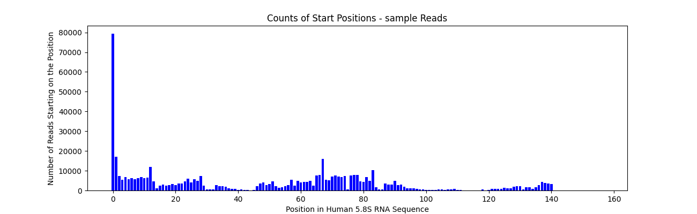
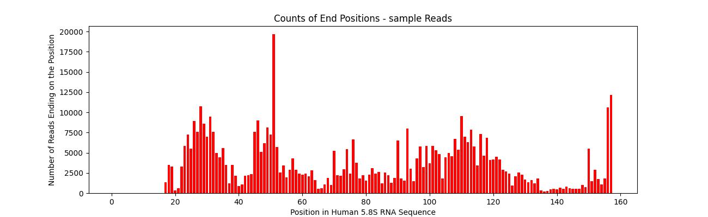
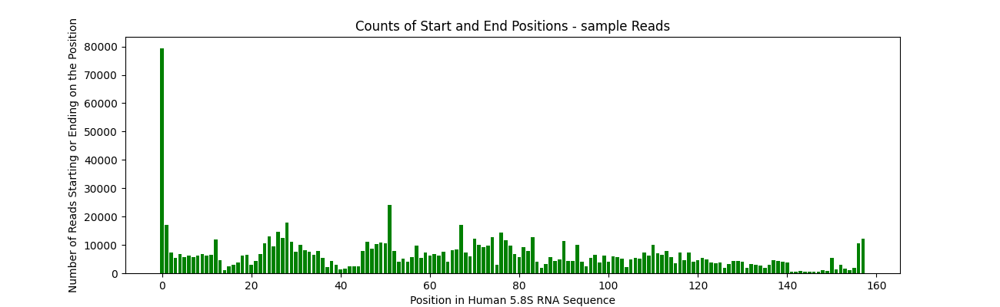
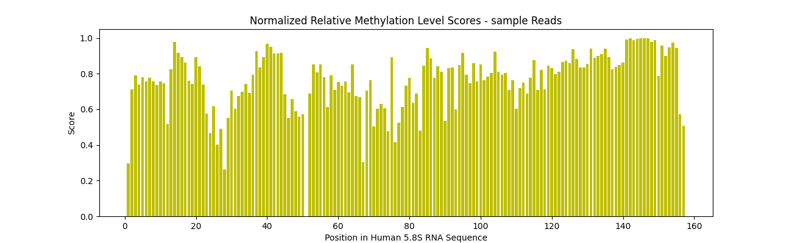

# RiboMethSeq Analysis
Author: John Paul Wick

16 September 2024

# Background

Many types of RNA can be modified in various ways after transcription. Similar to DNA, one of the most common RNA-modifications is methylation. This particularly can happen at the 2’ OH of the RNA sugar backbone, in which the hydroxyl is replaced with a methyl group. This can affect both the structure and the function of these RNAs. The enzymes which are known to catalyze these modifications are associated with disease, and so it is of importance to characterize and understand the methylation profiles of RNA sequences, as these profiles may shine light on the structural and functional differences of the RNAs contributing to pathology

One of the structural changes conferred by 2’-O methylations is increased stability, such that the phosphodiester bond immediately 3’ to the methylated nucleotide is more resistant to nucleophilic attacks such as hydrolysis. Taking advantage of this, the RiboMethSeq method involves hydrolytic fragmentation of an RNA sample in an alkaline solution, and then PCR amplification and next-generation sequencing of the resulting fragments. The idea is that the representation of fragments starting at position N+1 or ending at position N will be inversely proportional to the rate of methylation of the nucleotide at position N. In other words, RNA with high rates of methylation at position N will yield few fragments starting at N+1 or ending at N. By aligning all the sequences and counting the number of fragments starts and ends at each position, the methylation profile of the sequenced RNA can be characterized. 

# Purpose

My primary goal with this pipeline is to be able to accurately portray the methylation profile of the sequenced RNA. For a reference for what such a profile looks like for 5.8S rRNA, see figure 2 from Pichot et al. describing “typical RiboMethSeq profiles for human 5.8S rRNA” [1].

# Pipeline

The pipeline I present in this project is meant for just the above: it takes a reference RNA sequence and aligns NGS reads of RiboMethSeq fragments to it. Then, it constructs and saves methylation profiles by counting start and end positions of the fragments (strandedness of the reads is ignored; the algorithm simply counts 5’ and 3’ end positions). The tool analyzes only one FASTQ at a time. A typical alignment pipeline is followed: the reference is indexed by Bowtie2, and the reads are aligned to the reference using Bowtie2 to generate a sam file. Then, samtools is used to convert the sam file to a bam file, sort the bam file, and index it. Finally, the pysam package is used to create a pysam alignment file, from which start and end positions can be extracted while iterating through the fragment reads. One important feature of this pipeline is the lack of trimming in the reads. While this could cause a number of fragments to fail alignment, it is more important that the start and end positions of the fragments are preserved for the purposes of this analysis. 

This project consists of a RiboMethSeq analysis pipeline called ribomethprofile.py.
Sample files are included to test the pipeline: a reference sequence of the human 5.8S RNA called reference.fasta and a FASTQ file of RiboMethSeq reads, called sample.fastq (taken from the RNAmodR.Data Bioconductor package for R: https://www.bioconductor.org/packages/release/data/experiment/manuals/RNAmodR.Data/man/RNAmodR.Data.pdf). 

The pipeline is set to analyze the 5.8S RNA reference present, along with any input fastq reads specified in the call to run the function.  

A subdirectory called "temp" is created during the analysis to store the intermediate files such as reference index files, sams, bams, and sorted bams. If there is already a folder named temp in the directory containing the script, it will not create a new one but operate within that. However, the temp directory is deleted at the end of the analysis. If there is a folder named temp containing files which should not be deleted, this can be avoided by renaming the folder, moving it, or updating the python script so that temp is not deleted. To keep the temp folder containing the sam, bam, and sorted bam files generated in the analysis, comment out line 199 of the script before running. 

The output of the RiboMethSeq analysis contains four PNG images saved locally. These images describe the methylation profile of the sample being analyzed; the first shows a barplot of total counts of starts and ends (5' and 3' extremes) in the RNA fragments by base position, the second shows only the counts of the fragment starts (5' extremes) by position, and the third shows only the counts of the fragment ends (3' extremes) by position. The last image is a graphic showing relative methylation rates derived from the combined 5' and 3' end counts, using a custom scoring function based on min-max normalization of fractions of reads. 

# Instructions

To replicate the analysis, follow the instructions below (for linux terminal). Be sure to wait for the message in the terminal that the analysis is complete - it may take a minute.

1. Save ribomethpipeline.py, reference.fasta, and sample.fastq to a single local directory.

2. Cd into the directory and ensure that the appropriate fasta and fastq files are present in the directory.

3. Run the following (replace "sample.fastq" with your fastq if you wish to analyze a different set of RiboMethSeq reads):
python3 ribomethprofile.py sample.fastq

# Reference Paper:

1. Florian Pichot, Virginie Marchand, Mark Helm, Yuri Motorin, Machine learning algorithm for precise prediction of 2′-O-methylation (Nm) sites from experimental RiboMethSeq datasets, Methods, Volume 203, 2022, Pages 311-321, ISSN 1046-2023, https://doi.org/10.1016/j.ymeth.2022.03.007.

# Results

Below are the resulting bar plots showing RiboMethSeq profiles for the data generated by my pipeline, using the sample 5.8S rRNA reads taken from RNAmodR.Data:

Note the high level of similarity between my profiles and those from Pichot, including the apparent methylations at positions 14 and 75. Like the figure by Pichot, I used 0-(n-1) numbering of positions for the start counts, to essentially shift the columns back one position (as starts at N+1 position will be underrepresented for methylated nucleotides at position N). This adjustment was not needed for the 3’ end counts. When adding counts for the totals, I was sure to keep the adjustment for the 5’ ends. The differences in methylation at some of the bases may be attributable to differences in methylation rates at those bases between the rRNAs sequenced. Slightly uneven representation of certain fragments after amplification can also affect the results. 
There are some slight differences in methylation rates between my constructed profiles and the ones shown in figure 2 by Pichot above. This makes sense as it would be expected by chance for two normal profiles to vary slightly. One notable difference, however, in my constructed profiles is the high representation of position 51 as a 3’ end – this is high enough to dramatically affect the combined counts profile at that position as well. This suggests significantly lower methylation rates at position 51 in the 5.8S rRNA taken from RNAmodR.Data. 

Finally, I include a graph of relative methylation levels for each position. These scores were calculated by taking the fraction of all 5’ and 3’ counts which appear at a given position, and min-max normalizing them so that they appear in the range 0-1 for easier interpretability and comparison. As higher representation results in a higher score based on fraction, I subtracted each score from 1 so that positions with lower representation (and thus higher methylation) score higher. Then, I plot these methylation scores by position:

Notice how the resulting graphic is basically an inverted version of the third plot above with the total counts, such that higher instead of lower bars correspond to higher methylation. Note that this plot does not include quantitative information about methylation rates – it simply shows the relative methylation rates of each position to make it easy to find interesting cases or compare a position with other nearby positions. The zero-indexed position was excluded given its extremely high count, and so it is apparent that position 51 is the lowest reference point. Again, position 75 stands out once more as a highly methylated position in comparison to nearby positions.

# Conclusions

This is an example of a next generation sequence analysis method which would not be possible outside the bioinformatics space. Even should RiboMethSeq fragments be able to be obtained, amplified, and sequenced at NGS levels, no valuable information would be ascertained without the high-scale alignment, indexing, and parsing tools widely available today. RiboMethSeq in particular is a relatively recent development, emerging in the last decade. As such, there is room for improvement in current implementations and there is still much to be learned about the patterns and purposes of methylation of RNA, ribosomal and otherwise. The analysis tool I’ve developed spans the simple theory behind RiboMethSeq analysis, but full interpretation of these profiles will require more publications of experimental analyses such as genetic modifications of enzymes involved in the addition of these methyl groups to RNA. I believe that in the near future, RiboMethSeq will contribute to massive advances in our understanding of RNA methylation and in applications for personalized medicine.
